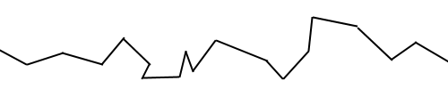
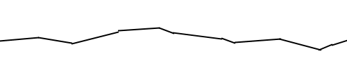
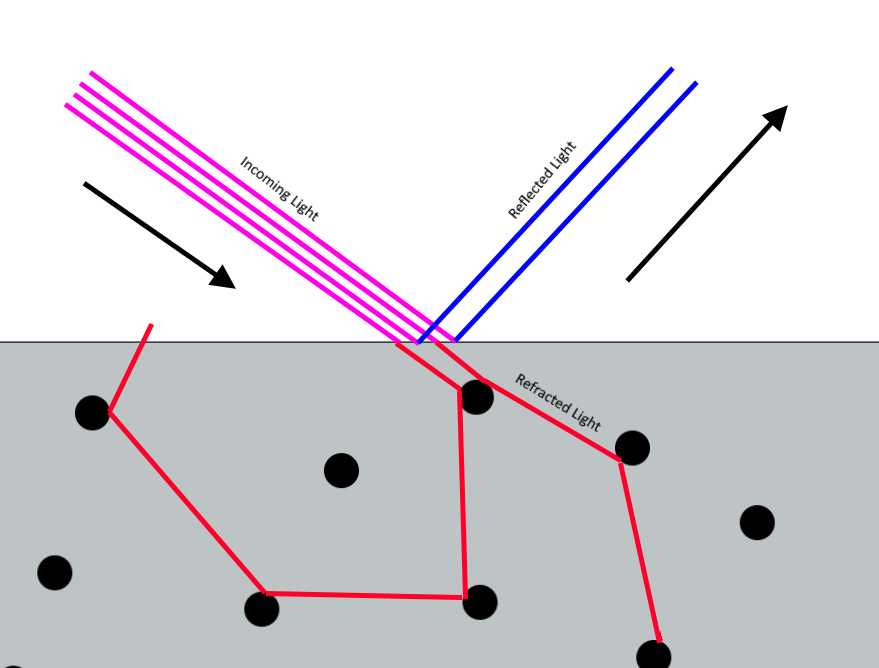
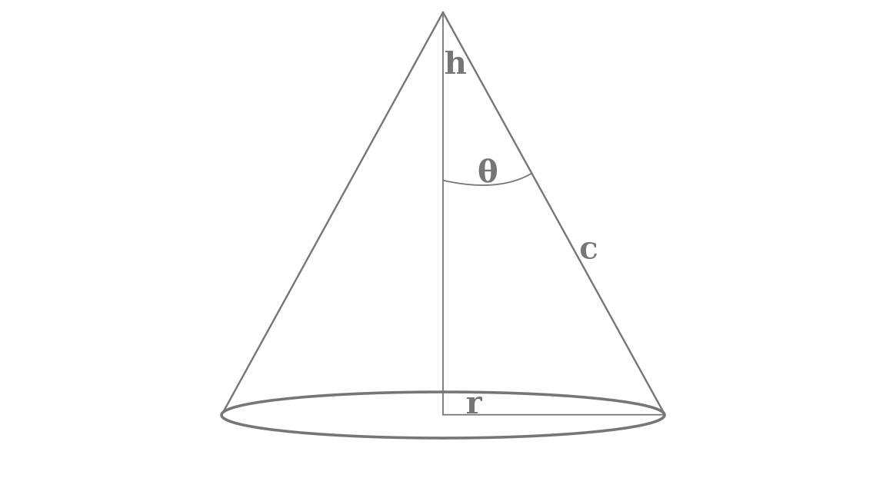
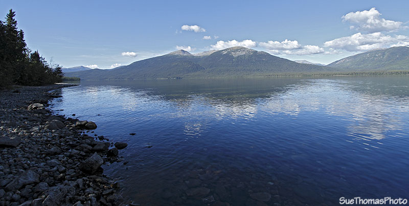

# Physically Based Rendering

I will now describe Physically Based Rendering as a self-test regarding whether or not I have sufficiently understood it.

Physically Based Rendering is a model that approximates. It attempts to recreate the physical processes that occur in the real-world in order to give us some triangles on the screen that feel good to look at.

For an accurate execution of such a complex task, there are three  it must fulfill three requirements

1. Be based on the microfacet model.
2. Be energy conserving. 
3. Use a physically-based BRDF in their reflectance equation

All three will be approached in greater detail in the following paragraphs:

## Microfacet Model

No matter how smooth or rough, every surface can be interpreted as a group of microfacets. While at the macroscopic level surfaces can be perceptually simplified into a singular surface with a single normal, this is not the case at the microscopic level as that would require a perfectly smooth surface, which does not exist.
The smoothness degree of the surface affects the variance of the normals of these facets. The rougher the surface, the more chaotic the microfacet normals are, and generally less aligned with the surface normal too. 

<figure>

<figcaption> Microfacets in a rougher surface </figcaption>
</figure> 

<figure>

<figcaption> Microfacets in a smoother surface </figcaption>
</figure> 

Due to the infinitesimal nature of these surfaces, we do not individually measure their normals or their variance but instead abstract the roughness of the surface into a single number parameter. This roughness parameter can be used to estimate the ratio of microfacets which are aligned to the halfway vector between incoming and outgoing light. This will be useful later.

## Energy Conservation

In the real world, we do not actually see objects, we merely see the light that bounces off of them and into the photosensitive organs in our face. Light is energy, and energy is always conserved. Any system that attempts to replicate the effects of light must respect this rule. This particular conservation of energy can be represented as:

$$ E_{incoming} = E_{reflected} + E_{refracted}$$

In practice, this means that outgoing energy must match incoming energy. Which is, on any given surface, the amount of incoming light equals the sum of the reflected and refracted parts. A surface should be seen as a boundary between two mediums, when an incoming amount of light hits a surface, part of it is reflected and remains in the same medium. The part of it that isn't reflected proceeds by refraction into the other medium.

<figure>

<figcaption> Decomposition of light at surface between mediums </figcaption>
</figure> 

In computer graphics the reflected component is understood to be the specular component while part of the light that gets refracted is eventually represented by the diffuse component. The diffuse component represents the fraction of refracted light that gets returned to the first medium after bouncing around particles in the second medium.

Not all the refracted light becomes diffuse light. Every time a beam of light collides with a particle some of its energy is dissipated and transferred over into the particle as kinetic evergy (aka heat). Beams of light might be thus completely absorbed before being bounced back out to its original medium. 

Additionally, in order to simplify the rendering process we assume that the distance between point of refraction and the bounce-back point to be infinitesimal. More advanced techniques such as subsurface scattering do not simplify this detail and are able to represent better reconstructions of highly refractive materials, such as honey.

## Reflectance equation

The reflectance equation (or rendering equation) attempts to model the process through which we create realistic depictions of light, it can be represented as follows:

$$ L_o(p, \omega_o) = L_e (p, \omega_o) + L_r (p,\omega_o) $$

$$ L_r(p, \omega_o) = \int_\Omega  f_r(p, \omega_i, \omega_o) \space L_i(p, \omega_i)\space n \cdot \omega_i \space d \omega_i $$

In this document we will be focusing in non-emissive surface, therefore:

$$L_e(p, \omega_o) = 0$$

$$ L_o(p, \omega_o) = L_r (p,\omega_o) $$

$$ L_o(p, \omega_o) = \int_\Omega  f_r(p, \omega_i, \omega_o) \space L_i(p, \omega_i)\space n \cdot \omega_i \space d \omega_i $$

This last equation is the one we will attempt to dissect over the next few sub-chapters. There are a few concepts we have to broach first.

### Radiance on a point

Let's say we have a point P on a surface A that is being illuminated by a light source. That is, there is a cone of light traveling through space between a source (tip of the cone) and a surface (base of the cone). And on the center of the base of this cone we have the aforementioned point P.

The light source possesses the following characteristics:

- [**Radiant flux $\Phi$**](https://en.wikipedia.org/wiki/Radiant_flux), the total energy transmitted per unit of time, measured in watts.
- [**Solid angle $\Omega$**](https://en.wikipedia.org/wiki/Solid_angle), how wide the cone of light projection is, this angle is shown as $\Theta$ below.

<figure>

<figcaption> Picture taken from <a href="https://en.wikipedia.org/wiki/Cone">Wikipedia</a></figcaption>
</figure> 

 - **Projected area**, the area covered by the light on the surface, represented by the base of the cone in the image.
 - [**Radiant intensity I**](https://en.wikipedia.org/wiki/Radiant_intensity), the radiant flux per solid angle.
  
  $$I = \frac{\delta \Phi}{\delta \omega}   $$

  Using these three values, we can calculate the **radiance** of the surface. Radiance is the radiant flux emitted by a surface per solid angle per projected area unit. It can be represented as

  $$ L_i = \frac{\delta^2 \Phi_e}{\delta \Omega \space \delta(A \cdot \cos \Theta)} $$

  But how does this all relate to computer graphics? Well, if we assume area $A$ and solid angle $\omega$ to be infinitesimal (this turning our cone into a vector) we can calculate how much a single vector of light impacts the appearance of a a single point/fragment in space.

  More realistically, we want to know the sum of the impacts of all the light vectors incoming onto a given fragment. To calculate the sum of all the vectors in the hemisphere aligned with the surface's normal, we integrate over all incoming light directions in the hemisphere denoted by the surface normal. This is why the integral is found in the reflectance equation above.

 ### Incidence angle

  Another important fact to remember is that the radiance is affected by the incident angle between the light source and the surface normal. The greater the angle the greater the incline at which the light hits the surface and the greater the area through which the same light beams have to be spread over. On the other hand, with a smaller incident angle the same radiant flux is concentrated on a smaller area, resulting in higher radiance. This is the reasoning behind the $n \cdot \omega_i$ component of the reflectance equation.

### Bidirectional Reflective Distribution Function

 The BRDF is the remaining part of the rendering equation we have not explained yet. Above we represented it as $f_r(p, \omega_i, \omega_o)$. This function attempts to calculate how much each incoming ray of light contributes towards the output, taking into account inherent material qualities like smoothness. As previously stated, the rougher a material is, the more chaotic the alignment of its microfacets. This means that for each incoming ray of light will be split into many smaller one with a smaller radiant flux, since energy must be conserved after all. Conversely it also means that for every non-perfectly smooth surfaces (i.e. all of them) each outgoing ray of light is the sum of many contributions from many different incoming light rays. 
 
 A hypothetical perfectly smooth surface will translate each incoming ray into a single equal radiant flux output. Under these circumstances the $f_r(p, \omega_i, \omega_o)$ component of the reflectance equation for a given $\omega_o$ would equal zero for all values of $\omega_i$ except the one exactly symmetrical to $\omega_o$ (using the surface normal as the symmetry axis), for this value the result would equal 1.

## The Cook-Torrance BRDF

There are many BRDF's that can suit the purpose of graphics rendering, you are free to slot one out and another into its place as it suits your goals. Right now we will proceed to use the Cook-Torrance BRDF:

$$f_r(p, \omega_i, \omega_o) = k_d f_{lambert} + k_s f_{cook-torrance}$$

In the above equation $k_d$ corresponds to the diffuse component, that is, the amount of light that gets refracted but not absorbed, while $k_s$ refers to the specular component.

$f_{lambert}$ is known as the _lambertian diffuse_ and can be represented as 

$$f_{lambert} = \frac{c}{\pi}$$

while the specular part, called the _Cook-Torrance specular component_ has a bit extra nuance:

$$f_{cook-torrance} = \frac{NDF \cdot F \cdot G}{4(\omega_o \cdot n)(\omega_i \cdot n)}$$

This component can, itself, be further broken down into its three sub-components, they are the Normal Distribution Function, the Fresnell equation and the Geometry function. Each of which will get its own paragraph below.

### Normal Distribution Function

The NDF approximates the effects of the roughness of the surface and how the alignment of the microfacets affect the visual aspect of the surface. It calculates the ratio of microfacets that are aligned with the halfway vector between the incoming light vector and the surface normal.

Just like the whole BRDF, this sub-component can also be seen as modular. There are many NDF's that can be used to fulfill the requirements of a physically based renderer, such as the _Trowbridge-Reitz GGX_

$$NDF_{GGXTR}(n,h,a) =  \frac{\alpha^2}{\pi((n \cdot h)^2 (\alpha^2 - 1) + 1)^2}$$

In this equation, $h$ corresponds to the halfway vector mentioned above, while $\alpha \in [0,1]$ corresponds to an abstraction value of how rough the surface is. The greater the value of roughness the less localized, but also less intense the specular aspect of the light will be, as can be seen on the following picture.

<figure>

<figcaption> Picture taken from <a href="https://learnopengl.com/PBR/Theory">learnopenGL.com</a>  </figcaption>
</figure> 

### Fresnell Equation

The [Fresnell effect](https://en.wikipedia.org/wiki/Fresnel_equations) describes how the ratios between incident light, reflected light and refracted light change according to medium characteristics and angle of incidence. 

<figure>

<figcaption> Example of the Fresnell effect on a lake surface. <a href="http://suethomas.ca/SouthCanol2.html">Picture source.</a>  </figcaption>
</figure> 

 Notice how at lower angles of incidence the refracted component is higher, which lets us see the rocks on the bottom of the lake. Conversely at higher angles the reflected component is higher which allows us to see the mountains reflected against the water surface. 
 
 
 As you can see in the above spherical object, this effect has to be kept in mind when rendering any object, not just liquids. Towards the edges of the sphere the angle of incidence increases and with that increase the ratio begins skewing more towards the specular component.

Calculating this effect using the raw Fresnell Equation can be quite computationally demanding. In order to make the model more accessible we instead make use of the Fresnell-Schlick approximation:

$$ F_{Schlick}(h,v,F_0) = F_0 + (1 - F_0)(1 - (h \cdot v)^5)$$

In this representation, $F_0$ represents the reflectivity of the surface on a perpendicular ($0^o$) angle of incidence. Which is also the point at which this sub-component is the lowest. As the angle of incidence increases, so does the reflected component weight in the total light leaving the surface. 

<figure>

<figcaption> Example of the Fresnell effect on a sphere. <a href="https://learnopengl.com/PBR/Theory">Picture source.</a>  </figcaption>
</figure> 

$F_0$ depends on the material that we are looking at and is not always the same. [Here](https://refractiveindex.info/) you can find a good data regarding the refractive index of different materials per wavelength. Furthermore, at this stage we also have to start taking into account the nature of the surface's material, more specifically if it is a conductive/metallic or dielectric surface.

These two kinds of materials have two different Fresnell equations. The obvious approach here is to have a variable that keeps track of whether n order not to need to use two different fresnel equations. But we can do something better. Knowing that not only do dielectric surfaces have a much lower reflectivity index that metallic ones, but that they also have a much lower variance of values between different surfaces, we can simplify the process. 

We take a base reflectivity value and make it constant across all dielectric surfaces, we can use this value as our $F_{Schlick Dielectric}$. We use the $F_0$ taken from a materials database and run it through the equation above to calculate its $F_{SchlickMetallic}$. Then we only need to perform linear interpolation of these two values to determine the Fresnell component for that surface with the material's given level of _metallicness_.

### Geometry Function

Given that the surface is never perfectly smooth, it is fair to assume that, despite appearing otherwise, a percentage of the surface is never visible to us as it stays behind crests and crevices caused by microfacets.

<figure>

<figcaption> Example of the geometry occlusion. <a href="https://learnopengl.com/PBR/Theory">Picture source.</a>  </figcaption>
</figure> 

To represent this effect we will use the Schlick-GGX approximation:

$$ G_{SchlickGGX}(n,v,k) = \frac{n \cdot v}{(n \cdot v)(1 - k) + k} $$

where:

$$k_{IBL} = \frac{\alpha^2}{2}$$

Because the geometry causes two types of occlusion (obstruction and shadowing), we are forced to use two Schlick-GGX approximations, like so:

$$G(n,v,l,k) = G_{sub}(n,v,k) \space G_{sub}(n,l,k)$$

The result of this function will give us a per-fragment multiplier (between 0 and 1) that denotes the amount of microfacet shadowing in a given area of the surface. This multiplier varies according to the surfaces roughness.

<figure>

<figcaption> Example of the geometry shadowing. <a href="https://learnopengl.com/PBR/Theory">Picture source.</a>  </figcaption>
</figure> 

## The Cook-Torrance BRDF (Decomposed)

Putting every sub-component back together in the reflectance equation gives us

$$L_0(p,\omega_o) = \int_\Omega (k_d\frac{c}{\pi} + \frac{NDF \cdot F \cdot G}{4 (\omega_o \cdot n)(\omega_i \cdot n)}) L_i(p,\omega_i) n \cdot \omega_i \space d\omega_i $$

Thus we finally arrive at the final equation that describes a physically based rendering model

### Diffuse Irradiance

TO DO 

### Specular Irradiance 

TO DO